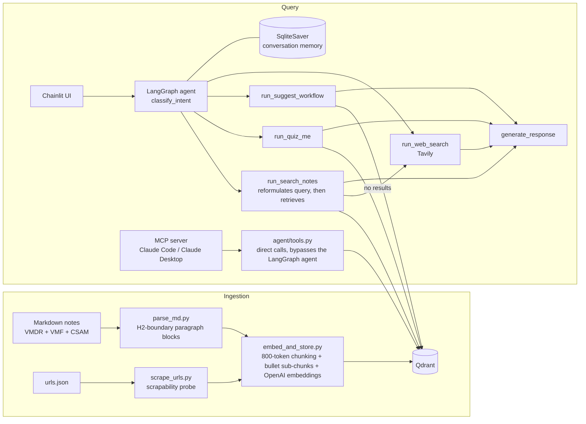

# QualysGPT

**An agentic RAG assistant grounded in Qualys certification knowledge — exposed through a chat UI and an MCP server for Claude Code and Claude Desktop.**

QualysGPT answers questions about Qualys platform workflows (VMDR, CSAM, VMF) using a retrieval-augmented LangGraph agent that refuses to answer when it cannot ground a response in its knowledge base. Built as a daily-driver tool for security analyst work and certification prep.

> **Grounding guarantee:** if the vector store is unreachable or retrieval returns nothing relevant, the agent says so — it never fabricates an answer.

---

## Demo

<!-- TODO Day 9: embed Loom link + 1-2 screenshots -->
<!-- Screenshot 1: Chainlit answering with [Source: ...] attribution -->
<!-- Screenshot 2: the 4 MCP tools visible in Claude Desktop -->

---

## Validation

- **Knowledge base:** 475 vectors across 3 certifications (VMF, VMDR, CSAM) — course notes, lab walkthroughs, and probed/scraped official documentation
- **Benchmark:** 90% (27/30) per certification on private held-out question sets that mimic the standardized Qualys certification exams (exam-derived, not redistributable — see [Evals](#evals))
- **In production use:** daily driver for Qualys Technical Security Analyst workflows and certification study

---

## Architecture



**RAG patterns implemented** (mapped to standard taxonomy):

- **Agentic RAG** — the LangGraph agent orchestrates tool selection and loops until it can answer or determines it cannot
- **RAG with Memory** — LangGraph `SqliteSaver` checkpointing gives every conversation persistent multi-turn state, keyed to stable Chainlit thread IDs
- **Document-aware chunking** — markdown H2 sections are the primary chunk boundary, preserving the logical structure of the source notes
- **Small-to-big (hierarchical) chunking** — definition-dense sections are sub-chunked at the labeled-bullet level (40-token minimum, deduplicated against the parent) while parent overview chunks stay in the index; precise sub-chunks win specific queries, parents win broad ones
- **Contextual prefixing** — every chunk embeds with its `cert / module / topic` chain, so retrieval results self-identify their source
- **Query reformulation** — vague follow-ups ("give me more detail") are rewritten into standalone search queries using conversation context before hitting the vector store, with fail-open fallback to the raw query

---

## Design decisions

**Hard-fail grounding, fail-open reformulation.** The two failure modes are treated asymmetrically on purpose. A grounding failure (Qdrant unreachable, no relevant chunks) produces wrong answers if papered over — so the agent refuses. A reformulation failure only degrades retrieval quality slightly — so it falls back to the raw query and proceeds. Refuse where errors compound; degrade where they don't.

**Scrapability probing before ingestion.** The URL pipeline probes every source before scraping: HTTP errors, login/SSO redirects, password-field pages, and sub-200-word JS shells are marked `scrapable: false` and ingested as a single reference-link chunk instead of garbage text. Of 61 supplementary URLs, 8 passed the probe; the other 53 surface as attributed reference links rather than polluting retrieval. Verdicts are written back to `urls.json` with timestamps, and manual overrides stick.

**Measured chunking iteration.** The bullet-level sub-chunking design went through three measured iterations (100-token minimum → near-duplicate parent problem → 40-token minimum + 80% parent-overlap dedup guard), each with pre-committed success criteria on fixed test queries. Final result: sub-chunks outrank parent overview chunks on property-specific queries while broad-query behavior is unchanged.

**Stable session identity.** Chat resume uses Chainlit's native persistent `thread_id` as the LangGraph checkpoint key — an earlier design generated random per-session IDs that silently broke conversation resume across restarts.

---

## MCP integration

The agent's tools are exposed as an MCP server (FastMCP, stdio transport) consumed by two clients:

| Client | Transport | Mechanism |
|---|---|---|
| Claude Code | stdio | project-scoped `.mcp.json` |
| Claude Desktop | stdio | `.mcpb` Desktop Extension bundle |
| claude.ai (web) | remote HTTPS | roadmap — requires hosted deployment |

Four tools: `qualys_search_notes`, `qualys_quiz_me`, `qualys_suggest_workflow`, `qualys_web_search`. The `.mcpb` bundle acts as a thin launcher pointing at the project environment (see [Known limitations](#known-issues--limitations)).

In MCP contexts the consuming client (Claude) provides orchestration, so tools are exposed directly; the LangGraph agent serves the Chainlit path.

---

## Evals

Benchmarking uses an automated harness (`evals/run_exam.py`) with a verification gate: it refuses to run any question bank containing unverified answer keys.

- **Private held-out sets** (`evals/private/`, not redistributed): 30 questions per certification mimicking the standardized Qualys cert exam format and distribution. QualysGPT v1 scored **90% (27/30) on both VMDR and CSAM** under a zero-intervention protocol — every answer chosen by the tool, none overridden. Automated harness runs against these sets are the next tracked baseline.
- **Public practice bank** (`evals/vmdr_practice_v1.json`): 50 original exam-style questions authored against the published VMDR domain blueprint — benchmark runs pending, results will be committed to `evals/results/`.
- **Two modes:** `--mode notes-only` (web search disabled — measures pure knowledge-base coverage) and `--mode full` (all tools).
- **Failure autopsy:** wrong answers are classified as retrieval misses vs reasoning misses using retrieved-context overlap, feeding the improvement roadmap.

```
python evals/run_exam.py evals/vmdr_practice_v1.json --mode notes-only
python evals/run_exam.py evals/vmdr_practice_v1.json --mode full
```

---

## Setup

**Prerequisites:** Python 3.11, [Qdrant](https://qdrant.tech/) (standalone binary — this project does not use Docker), OpenAI API key (embeddings), Anthropic API key (agent), Tavily API key (web search).

```bash
git clone https://github.com/nishyanth-g/QualysGPT.git
cd QualysGPT
python -m venv venv
venv\Scripts\activate        # Windows
pip install -r requirements.txt
```

**Environment variables** — copy `.env.example` to `.env` and fill in real keys:

```bash
OPENAI_API_KEY=sk-your-openai-key-here      # embeddings (text-embedding-3-small) for ingestion + retrieval
ANTHROPIC_API_KEY=sk-ant-your-key-here      # LangGraph agent, quiz_me, suggest_workflow (claude-sonnet-4-6)
TAVILY_API_KEY=tvly-your-key-here           # web_search tool / no-results fallback
```

> Note: certification notes are not included (derived from Qualys training content). Place your own markdown notes in `data/raw/<CERT>/` following the format in `CLAUDE.md`.

**Run ingestion from scratch** (Qdrant must already be running):

```bash
python ingestion\embed_and_store.py --reset   # parses notes + scrapes urls.json, chunks, embeds, upserts
python tests\test_retrieval.py                 # verify: exit code 0, scores > 0.5, correct cert_name
```

Add `--cert VMDR` (or `VMF`, `CSAM`) to scope either command to a single certification.

**Launch the Chainlit UI:**

```bash
chainlit run ui\app.py
```

**Project structure** (top 2 levels):

```
QualysGPT/
├── agent/              # graph.py (LangGraph nodes/edges), tools.py (search_notes/quiz_me/suggest_workflow/web_search), prompts.py, agent.py (run/astream_events entry point)
├── data/               # raw/ (cert markdown, gitignored), urls.json (tracked), memory.db + chainlit.db (gitignored)
├── evals/              # run_exam.py harness, vmdr_practice_v1.json question bank, results/ (pending)
├── ingestion/          # parse_md.py, scrape_urls.py, embed_and_store.py
├── mcp_server/         # server.py (FastMCP stdio server), manifest.json + .mcpb bundle for Claude Desktop
├── retrieval/          # retriever.py (Qdrant + OpenAI embedding wrapper)
├── scripts/             # qa_cli.py (standalone terminal Q&A loop)
├── storage/             # Qdrant standalone-binary local data (gitignored)
├── tests/               # test_agent.py, test_retrieval.py, test_tools.py
├── ui/                  # app.py (Chainlit entry point)
├── requirements.txt
└── CLAUDE.md
```

**MCP client setup:** `.mcp.json` (Claude Code) and `mcp_server/manifest.json` (Desktop Extension) contain machine-specific absolute paths — edit them to your project location before use.

---

## Known issues & limitations

- **Broad-query ranking gap:** "What is a QID?" ranks a TruRisk/QDS chunk above the KnowledgeBase definition chunk (marked `xfail` in `tests/test_retrieval.py`). Persists after a full collection rebuild, ruling out contamination — motivates the hybrid search roadmap item below.
- **WAF-blocked documentation:** ~20 official Qualys docs URLs return HTTP 403 to plain requests or are JS-rendered shells; they are ingested as reference links only.
- **Quiz UX:** `qualys_quiz_me` returns the question and model answer in one payload — answer-reveal flow is a planned refinement.
- **Machine-specific MCP paths:** the `.mcpb` bundle launches the original project files by absolute path rather than vendoring dependencies (portable Python bundling has known limitations in the MCPB format).

---

## Roadmap

Each item traces to an observed failure mode or measured gap — not a feature wishlist.

**v1.5**
- **Hybrid search (BM25 + vector)** — motivated by the broad-query xfail above; Qualys content is dense with exact-match identifiers (QIDs, CVEs, query tokens) where keyword search complements embeddings
- **Cert-coherence reranking** — rerank retrieved chunks for certification consistency on ambiguous cross-cert queries
- **CSAM public eval bank** — extend the practice-bank benchmark to the second certification

**v2**
- **Corrective RAG (CRAG) gate** — extend hard-fail grounding with a retrieved-chunk relevance check that triggers web-search fallback when retrieval is weak, instead of binary refuse/answer
- **Adaptive retrieval routing** — skip retrieval entirely for trivial/conversational queries to cut latency and cost
- **Playwright-based fetching** — recover the ~20 WAF-blocked documentation URLs with a headless browser
- **Hosted MCP deployment** — remote HTTPS endpoint so the tools work in claude.ai web, requires deploying the server + Qdrant to a public host

**v3**
- **Multi-user platform** — auth, per-user memory, and a comprehensive cert knowledge base for Qualys analyst teams

---

## Stack

Python 3.11 · LangGraph (SqliteSaver memory) · Claude (via `langchain-anthropic`) · OpenAI `text-embedding` models · Qdrant · FastMCP · Chainlit 2.11.1 · Tavily · pytest

---

*Built by [Nishyanth Gollamudi](https://github.com/nishyanth-g) — CS @ Texas A&M, AI Engineering.*
